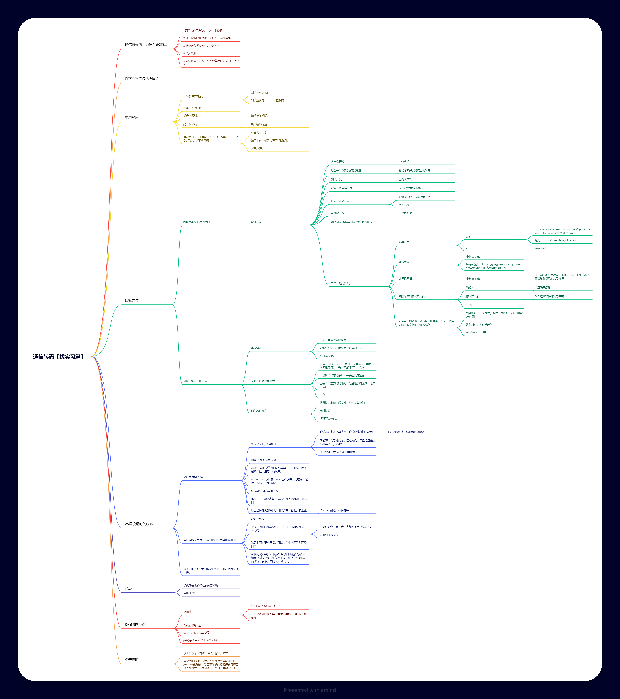

# 关于工作

> 多年以后，坐在出租屋的桌边，面前是理不完的红穿着黑的电线，示波器和电脑散乱地堆在沾满灰尘的电路板的上方。你将会想起那个在中大求学的那个遥远的下午。

> 那一天是期末周，路旁的校徽和树叶一样鲜艳，微风从耳畔吹过。正午的阳光却在割着你的脖子，试卷上的公式就像断头台。

- 对于毕业后的去向，几乎所有大学生都曾经犹豫过:
- 我要不要读研？
- 要考研还是保研？
- 要读研还是读博？
- 要去做软件还是硬件还是数学理论？
- 如果我想要走 xxx 方向但没有相关经验怎么办？
- 不想卷，厌学怎么办？
- 要选择出国吗？
- 要选择考公吗？
- 对于绝大部分人而言，不管你选择哪样最后都会经历找工作这个过程。
- 很多时候可能你真正不得不做决定的时候才会有自己的答案
- 另外，虽然几年后，不知道研究生的学位含金量还有多少，但是总的来说，全都是研究生之后，没有本科生还好就业的道理。不过如果你接受一个相对轻松，能让自己过得满足的生活方式，深造也并不那么重要。

由于本院（电子/通信/信息工程）极其广且杂的就业去向，工作这件事情是需要分很多种情况讨论的。如果你想要本科毕业直接工作，主要可以考虑以下方向：

*   **技术岗位**：
    *   **转码方向**：前端开发、后端开发、算法、测试等。涉及语言：`Java`, `C++`, `Python`, `Go`, `C#` 等。
    *   **本专业相关**：嵌入式软件、嵌入式硬件、射频、电子、通信、雷达等。涉及技能：`Verilog`, `MicroPython`, `C`, `汇编`, `Rust`, `Matlab`。
    *   *(注：Matlab 大概率用不上，它根本不能用于软件开发，主要是实验室仿真用的)*
*   **非技术岗位**：教师、产品经理、技术支持售前/售后、考公考编等。

---

## 1. 就业形势回顾与现状

这里必须要提到的是，现在的就业形势是非常严峻的。我之前去实习发现身边的全是研究生，而且很大比例是双 985 硕。不过，**如果本科生能达到和他们相接近的工程水平，那么你会有很大的优势，公司往往会认为你有更大的潜力。**

以下是近几年的就业市场变化回顾：

```text
2021 年：互联网辉煌时期，本科生凭一个项目就能拿大厂 offer。
2022 年：考研人数创新高（474 万），互联网寒冬，大厂 HC 紧缩，本科生就业率仅 27%。
2023 年：考研人数略回落但仍超 400 万，保研率上升，上岸难度增加。
2024 年：考研人数跌破 400 万，保外难度上升，本科就业仍面临压力。
```

:::tip
目前的形势来看，本科就业意愿逐渐回升。随着保研名额增加、考研名额缩减，**只要你无法保研，直接工作的必要性比之前更大了**。虽然研究生就业优势仍存在，但其“学历红利”正在减弱。本科就业绝对不是一个无法接受的选择——除非你大学四年真的什么都没学。
:::

---

## 2. 核心原则与策略

### 2.1 黄金法则

在互联网开发校招里，在学历过关的情况下，优先级的排序是：
> **对口实习 >> 八股文熟悉度 > 算法题能力 > 学历加成**

学历最多算锦上添花。所以如果你想去互联网大厂，最好是**大三上**就开始做实习等准备。如果等到大三下 3 月开学才开始转码，我不得不告诉你，这需要极大的运气。

*   **校招比社招更重要**：应届生身份一生只有一次。
*   **方向比公司规模更重要**：选对赛道（如 AI Infra、车联网等）比在夕阳部门苟延残喘重要。
*   **本科别想算法岗**：这已经是神仙打架的领域，不是十年前了。

### 2.2 秋招策略

*   **第一波秋招必须冲**：通常占据 HC（Headcount）的较大比例。
*   **特殊行业例外**：国企和游戏行业节奏不同（值得一提的是，游戏行业其实对代码水平的要求往往是最高的那一批）。
*   **经济下行周期的最优解**：早工作、早占坑的重要性不亚于保研考研。

**常用招聘平台：**
*   **牛客、BOSS 直聘**：面试经验丰富，适合找实习和刷面经。
*   **脉脉**：岗位信息更新快，能看到公司内部评价（避雷用）。
*   **OfferShow**：查看薪资爆料。

---

## 3. 不同路径的规划建议

### 路径 A：All in 互联网搞钱

如果你确定未来想进入互联网挣钱，那么读研的收益可能并不高。本科期间刷几个实习、好好准备校招，完全有可能拿到 40w+ 的 offer。

*   **性价比计算**：校招拿到开发岗位，三年后跳槽的工资通常不会低于研究生刚毕业的算法岗。算上这三年的收入和经验，确定性和性价比都很高。
*   **行动指南**：不必过于关注学校课程、活动或科研，**能顺利毕业即可**。重点是自学、做项目、积累日常实习和暑期实习。
*   **达标标准**：秋招前有两家大厂实习（平时刷简历+暑期实习争取转正）、掌握一定算法能力（LeetCode 200-300 题）、熟练八股。

### 路径 B：国企/外企与海外“水硕”

如果目标是开发岗位，本科直接就业几乎是无风险高收益的选择。但如果想去一些有**研究生学历硬性门槛**的国企：

*   **高性价比方案**：考虑香港或新加坡的**一年制硕士**。
*   **优势**：省时间、确定性强。只需要花几十万、考个托福或雅思，就能获得类似保研的效果。
*   **定位**：海外硕士主要是本科学历的放大器，只要进入 QS 前 100 的学校，认可度差别不大。如果暂时资金不足，也可以先工作两年存钱再读。

### 路径 C：学术与体制内

*   **选调生**：目前海外学历在选调中似乎不再那么受欢迎，建议老老实实国内读研。
*   **科研/博士**：建议**大二**就进实验室。
    *   如果不适合，尽早回归就业路线。
    *   如果适合，大三就要找好的导师，争取发表成果。很多 AI 方向的同学大三大四就能发高质量论文，最终直博或申请 Top 校 PhD。
    *   **警惕**：本科科研经历不足的同学，如果选择考研，往往是捡别人的剩余导师资源，科研发展潜力有限。

:::tip
最理想的情况是 **工作** 或 **考研** 只能选一个。
就我们学院而言，我认为对于一些 All in 考研失败的同学而言，就算他们最终找到了一份不错的工作，未来也比较难跟上公司内的工作节奏。
:::

---

## 4. 为什么要转码？（关于本专业的碎碎念）

值得注意的是，你院老师超过 50% 的主要研究方向为雷达、卫星（均属无线电电磁领域），接近 30% 的老师主要研究方向为通信相关领域，只有不到 20% 的老师研究方向涉及深度学习、具身智能等。

> 然而非常遗憾的是，如果同学们本科阶段将自己的时间大量投入在这些所谓高大上的学科中，几乎不可能在本科毕业时找到一份较为体面的本专业工作，等待你的要么是转行，要么是去做测试销售等非研发岗位。

当你打开招聘软件，搜索“雷达 + 本科”的关键词，便会发现合适的岗位寥寥无几。当你了解了著名的香农三定律并看到了 5G 商用的现状，便会发现夕阳的余晖早已照射到通信人的身上，而物联网和量子通信的红利更是遥遥无期。

---

## 5. 资源与避坑

**关于实习与自学：**

*   如何找到第一份实习
*   实习注意事项 / 租房与全国调动
*   入职第一天注意事项 / 职场大忌
*   **自学计算机的完整路线**：[CSDIY](https://csdiy.wiki/)

**通信转码路线（点击图片跳转）：**

<a href="../../.vuepress/public/figures/interneship.png" target="_blank">
    
</a>

**最后的忠告：**

> “只要培训三个月就能干” 是绝对错误的。
> 医生、工程师等职业，让一个高中毕业的人来干，培训一年都不一定能干好。很多东西都需要长久的努力和积累，不要轻信速成班的宣传。